## What we'll discuss

1. `shiny` 101
2. Building a `shiny` app
3. The user interface (UI)
4. The server
5. Take-aways

# shiny 101

## Why use `shiny`? {.build}

- To create apps!
- Because you want to:
    - host a standalone app on a webpage;
    - add interactivity to an `R` Markdown document (like this one!); 
    - build a dashboard. 
- And make your `R` workflows:
    - interactive (point-and-click style);
    - reproducible for non-coders;
    - look instantly professional.

## What is `shiny`? {.build}

- An `R` package for building interactive web apps. 
- A collection of wrapper functions to write "app languages":
    - geared toward `R` users who have zero experience with web development;
    - no knowledge of  HTML / CSS / JavaScript required;
    - but you *can* extend it with CSS themes, htmlwidgets, and JavaScript actions. 
- Developed by RStudio, so documentation and support are more or less guaranteed.

<!-- ## What does a `shiny` app look like? {.build} -->

<!-- - It depends...  -->
<!-- - But typically it includes: -->
<!--     - some input parameter(s); -->
<!--     - some invisible process(es); -->
<!--     - some output(s). -->
<!-- - Let's look at the `shiny` template app -->

## How to build a `shiny` app?
<div style="float: left; width: 50%;">
We have two options:

A. Create a file called `app.R` and add `shiny` components (file name and components are non-negotiable!) 

<div class = "green"> __B. In RStudio: File &rarr; New file &rarr; R Markdown &rarr; Shiny__ </div>
</div>

<div style="float: right; width: 50%;">
<div align="center">
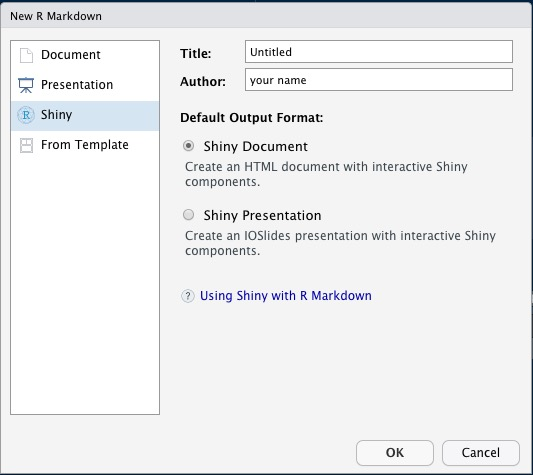
</div>
</div>

## The template app

<div align="center">
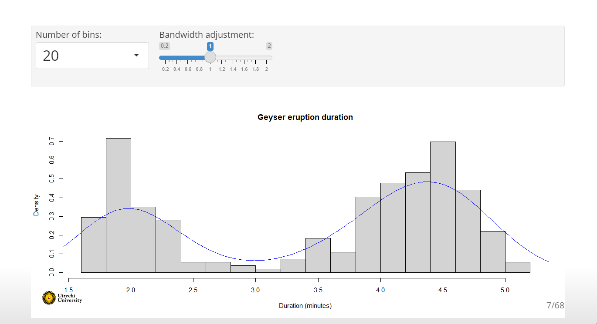
</div>

## Which components does a `shiny` app need? {.build}

- A user interface (UI):
    - the visible, interactive part;
    - e.g., a web app or dashboard.
- A server:
    - the invisible, processing part;
    - e.g., your own computer or [shinyapps.io](shinyapps.io).
    
You can see this in the default `shiny` structure:


```r
library(shiny)
ui <- fluidPage()
server <- function(input, output) {}
shinyApp(ui = ui, server = server)
```

# Building a shiny app

## Case study: BC liquor store 

Data on products sold by BC Liquor Store (source: [OpenDataBC](https://catalogue.data.gov.bc.ca/dataset/bc-liquor-store-product-price-list-historical-prices)).


```
## Rows: 6,132
## Columns: 7
## $ Type            <chr> "WINE", "WINE", "WINE", "WINE", "WINE", "WINE", "WINE"~
## $ Subtype         <chr> "TABLE WINE RED", "TABLE WINE WHITE", "TABLE WINE RED"~
## $ Country         <chr> "CANADA", "CANADA", "CANADA", "CANADA", "UNITED STATES~
## $ Name            <chr> "COPPER MOON - MALBEC", "DOMAINE D'OR - DRY", "SOMMET ~
## $ Alcohol_Content <dbl> 14.0, 11.5, 12.0, 11.0, 13.5, 11.0, 12.5, 12.0, 11.5, ~
## $ Price           <dbl> 30.99, 32.99, 29.99, 33.99, 36.99, 34.99, 119.00, 32.9~
## $ Sweetness       <int> 0, 0, 0, 1, 0, 0, 0, 0, 0, NA, 0, NA, NA, 0, 0, 2, 0, ~
```


## Case study: BC liquor store 

We're going to create a `shiny` app to visualize these data interactively.

Let's start with the empty `shiny` structure:


```r
library(shiny)
ui <- fluidPage()
server <- function(input, output) {}
shinyApp(ui = ui, server = server)
```


<div class="small">Note: to make sure `R` can find the data for your app (e.g., load it on the server side, or let the user upload a dataset)!</div>


## Our app

# The UI

## Adding a title


```r
ui <- fluidPage(
  titlePanel("BC Liquor Store prices")
)
```

The `shiny` function `titlePanel()` 

- adds a visible big title-like text to the top of the page;
- sets the “official” title of the web page (i.e., displayed at the name of the tab in the browser).

## Our app

<div align="center">
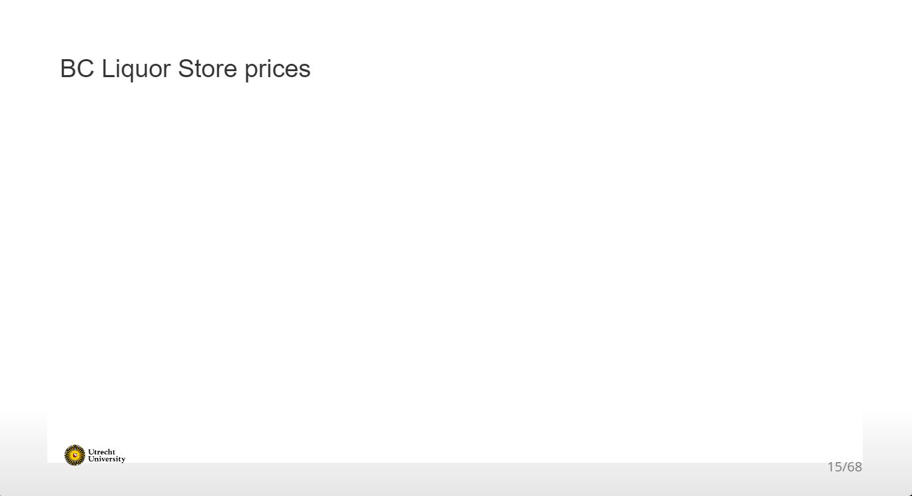
</div>

## Adding some text

To render text in our app, we can just add character/string objects inside `fluidPage()`:


```r
ui <- fluidPage(
  titlePanel("BC Liquor Store prices"),
  "BC Liquor Store", 
  "prices"
)
```

## Our app

<div align="center">
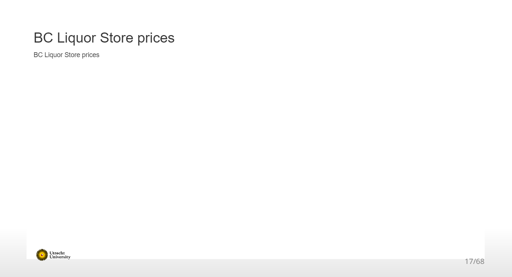
</div>

## Adding formatted text

For formatted text, `shiny` has many functions that are wrappers around HTML tags. For example:

- `h1()`: top-level header; 
- `h2()`: secondary header; 
- `strong()`: bold text; 
- `em()`: italicized text; 
- `br()`: line break;
- `img()`: image;
- `a()`: hyperlink, etc.

<div class="small">Note: if you already know HTML, you don't need to use these wrapper functions!</div>

## Adding formatted text

Let's replace the UI part of our code with the following:


```r
ui <- fluidPage(
  titlePanel("BC Liquor Store prices"),
  h2("BC"),
  "Liquor",
  br(),
  em("Store"),
  strong("prices")
)
```

## Our app

<div align="center">
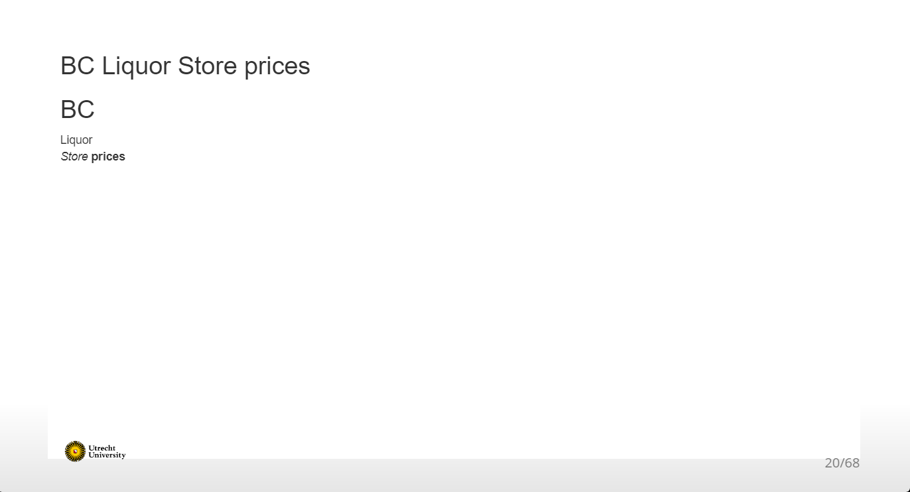
</div>

## Adding a layout {.build}

The simple sidebar layout: 

- provides a two-column layout with a smaller sidebar and a larger main panel; 
- visually separates the input and output of the app.

We'll replace the formatted text by a sidebar layout:


```r
ui <- fluidPage(
  titlePanel("BC Liquor Store prices"),
  sidebarLayout(
    sidebarPanel("[inputs]"),
    mainPanel("[outputs]")
  )
)
```


## Our app

<div align="center">
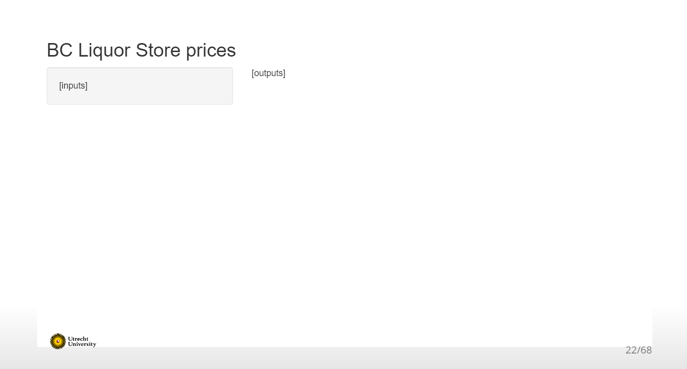
</div>

## Adding an input element 

Inputs allow users to interact with a `shiny` app. 

We've seen two types already:

- `selectInput()` creates a dropdown menu (e.g., number of bins in the template app);
- `sliderInput()` creates a numeric scale (e.g., bandwidth adjustment in the template app).


## Adding an input element 

Can you guess what kind of element these input functions will create?

- `textInput()`; 
- `dateInput()`; 
- `checkboxInput()`.

## Adding input elements

<div align="center">
<br>

</div>

## Adding an input element {.build}

If we want to add an input element for the variable price in our app, which function should be use?

- `radioButtons()`: choosing a specific number;
- `sliderInput()`: choosing a range of values on the slider.


```r
sliderInput(
  inputId = "priceInput", 
  label = "Price", 
  min = 0, 
  max = 100, 
  value = c(25, 40), 
  pre = "$"
)
```

## Adding an input element {.build}

All input functions have the same first two arguments:

- `inputId`, the name by which `shiny` will refer to this input when you want to retrieve its current value;
- `label`, which specifies the text displayed right above the input element.

These argument names are typically dropped from the `...Input()` function call: 


```r
sliderInput("priceInput", "Price", min = 0, max = 100, value = c(25, 40), pre = "$")
```

<div class="small">Note: Every input in your app *must* have a unique `inputId`; the app will not work properly otherwise! So keep your `inputId`s simple and sensible.</div>

## Adding an input element 

The resulting UI code looks like:


```r
ui <- fluidPage(
  titlePanel("BC Liquor Store prices"),
  sidebarLayout(
    sidebarPanel(
      sliderInput("priceInput", "Price", 
                  min = 0, max = 100, value = c(25, 40), pre = "$")
      ),
    mainPanel("[outputs]")
  )
)
```

## Our app

<div align="center">
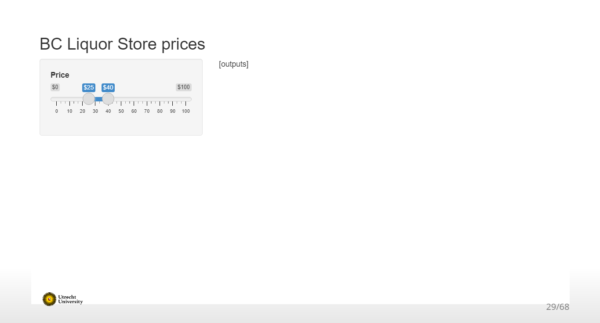
</div>

## Adding more input elements {.build}

Let's create input elements for the variables country and product type as well. Which input function(s) should we use if we want to restrict the user to only a few choices? 

We'll use a dropdown list for the countries Canada, France and Italy with `selectInput()`:


```r
selectInput("countryInput", "Country",
            choices = c("CANADA", "FRANCE", "ITALY"))
```

And for product type, we'll specify choices with `radioButtons()`:


```r
radioButtons("typeInput", "Product type",
            choices = c("BEER", "REFRESHMENT", "SPIRITS", "WINE"),
            selected = "WINE")
```

## Adding more input elements

The full UI code is now: 


```r
ui <- fluidPage(
  titlePanel("BC Liquor Store prices"),
  sidebarLayout(
    sidebarPanel(
      sliderInput("priceInput", "Price", 0, 100, c(25, 40), pre = "$"),
      radioButtons("typeInput", "Product type",
                  choices = c("BEER", "REFRESHMENT", "SPIRITS", "WINE"),
                  selected = "WINE"),
      selectInput("countryInput", "Country",
                  choices = c("CANADA", "FRANCE", "ITALY"))
    ),
    mainPanel("[outputs]")
  )
)
```

## Our app

<div align="center">
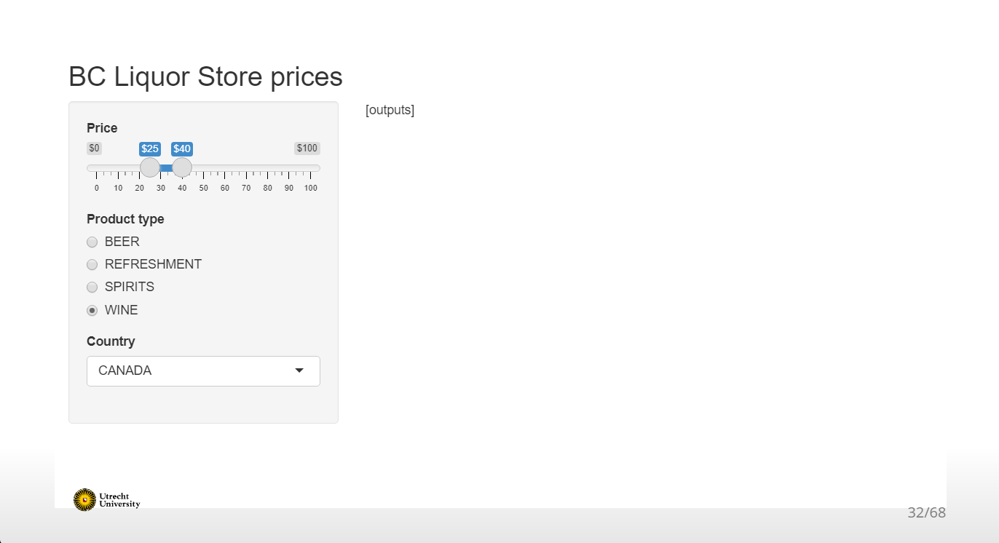
</div>


## Adding an output element {.build}

Outputs are *shown* in the UI, but *created* on the server side. 

That's why we add placeholders for the outputs in the UI. 

Placeholders:  

- Determine where an output will be; 
- Give outputs a unique ID to link it to the server; 
- Won’t actually show anything, yet.

Let's add a figure as output in our app: 


```r
mainPanel(
  plotOutput("coolplot")
)
```

## Our app

<div align="center">
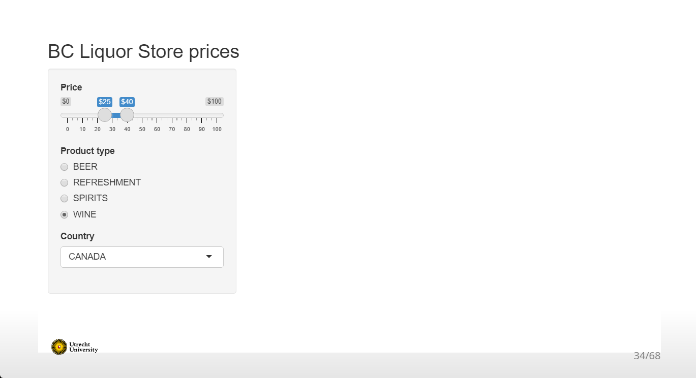
</div>


## Adding another output element

The placeholder doesn't show anything, because we haven't created any figure yet on the server side.

But first, let's add another output element:


```r
mainPanel(
  plotOutput("coolplot"),
  br(),
  br(),
  tableOutput("our_table")
)
```

<div class="small">Note: we added a few line breaks `br()` between the two outputs, so that they aren't crammed on top of each other.</div>

## The complete UI


```r
ui <- fluidPage(
  titlePanel("BC Liquor Store prices"),
  sidebarLayout(
    sidebarPanel(
      sliderInput("priceInput", "Price", 0, 100, c(25, 40), pre = "$"),
      radioButtons("typeInput", "Product type",
                  choices = c("BEER", "REFRESHMENT", "SPIRITS", "WINE"),
                  selected = "WINE"),
      selectInput("countryInput", "Country",
                  choices = c("CANADA", "FRANCE", "ITALY"))
    ),
    mainPanel(
      plotOutput("coolplot"),
      br(), 
      br(),
      tableOutput("our_table")
    )
  )
)
```

## Our app

<div align="center">

</div>


# The server

## The server function {.build}

<!-- The server is the part where the output is created, so it can be displayed in the UI.  -->


```r
library(shiny)
ui <- fluidPage()
server <- function(input, output) {}
shinyApp(ui = ui, server = server)
```

The server function:

- requires* input and output IDs from the UI;
- builds output objects via `render...()` functions;
- saves the generated output into an output list.

<div class="small">*exceptions apply!</div>

## Building some random output {.build}

Let's use the exception to the rule to develop our server step-by-step.

Instead of input from the UI, we'll use static data to fill in the placeholder plot:


```r
server <- function(input, output) {
  output$coolplot <- renderPlot({
  ggplot() +
    geom_histogram(aes(x = rnorm(100))) +
    ggtitle("Histogram of 100 random numbers (static)")
  })
}
```

## Our app

<div align="center">
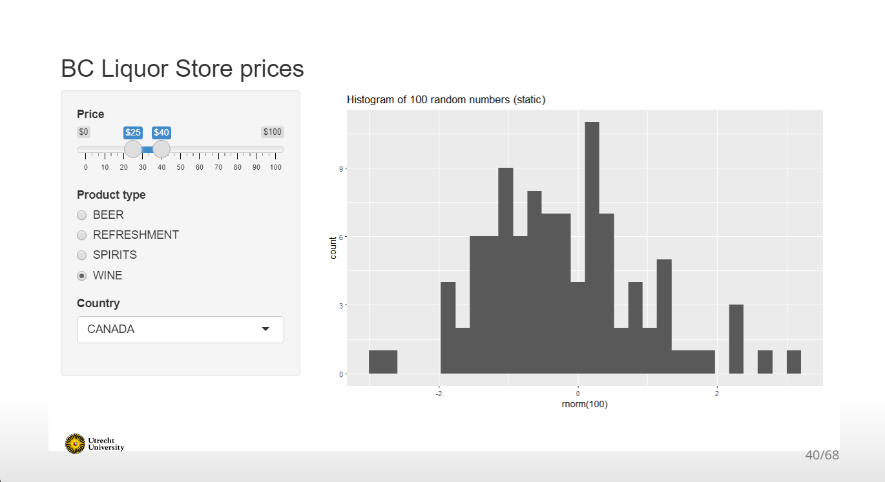
</div>


## Building some random output {.build}

To make the figure interactive, we have to link the server to the UI inputs. 

Let's use the price input to create some random data, interactively: 


```r
server <- function(input, output) {
  output$coolplot <- renderPlot({
  ggplot() +
    geom_histogram(aes(x = rnorm(input$priceInput[2]))) +
    ggtitle(paste("Histogram of", input$priceInput[2], "random numbers (interactive)"))
  })
}
```

So whenever the maximum price input changes, the plot updates and shows the specified number of points. 

## Our app

<div align="center">
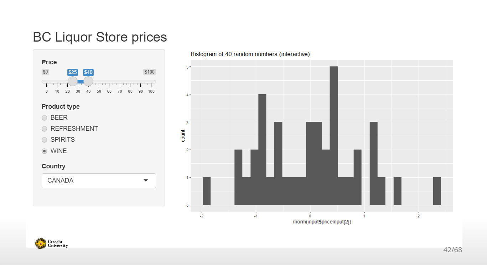
</div>


## Building the actual output {.build}

Now that we've seen the basics of interactivity, let's plot the case study data. 

We'll create a histogram of the percentage alcohol in the beverages. 

Ultimately, the plot should match the input elements interactively. But first, we'll plot a static version (briefly ignoring the inputs again):


```r
server <- function(input, output) {
  output$coolplot <- renderPlot({
    bcl %>% 
      ggplot(aes(Alcohol_Content)) +
        geom_histogram() +
        ggtitle("Histogram of alcohol content (static)")
  })
}
```

## Our app

<div align="center">
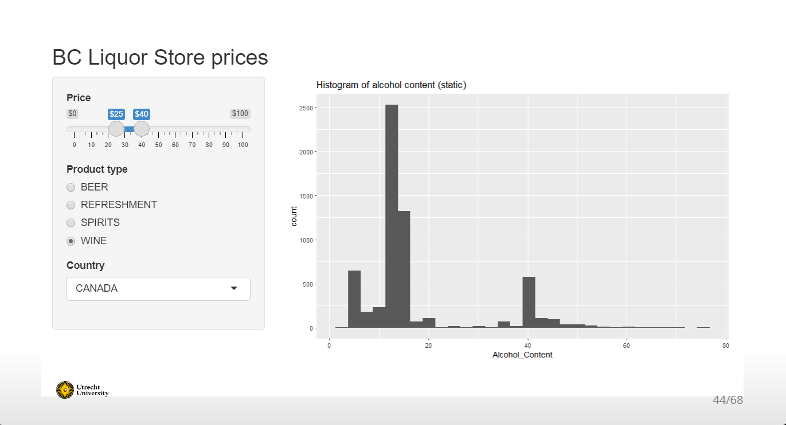
</div>


## Building the actual output 

To incorporate interactivity, we're going to filter the data based on the values of `priceInput`, `typeInput`, and `countryInput`:


```r
server <- function(input, output) {
  output$coolplot <- renderPlot({
  bcl %>%
    filter(Price >= input$priceInput[1],
           Price <= input$priceInput[2],
           Type == input$typeInput,
           Country == input$countryInput
    ) %>% 
    ggplot(aes(Alcohol_Content)) +
      geom_histogram() +
      ggtitle("Histogram of alcohol content (interactive)")
})
}
```

## Our app

<div align="center">
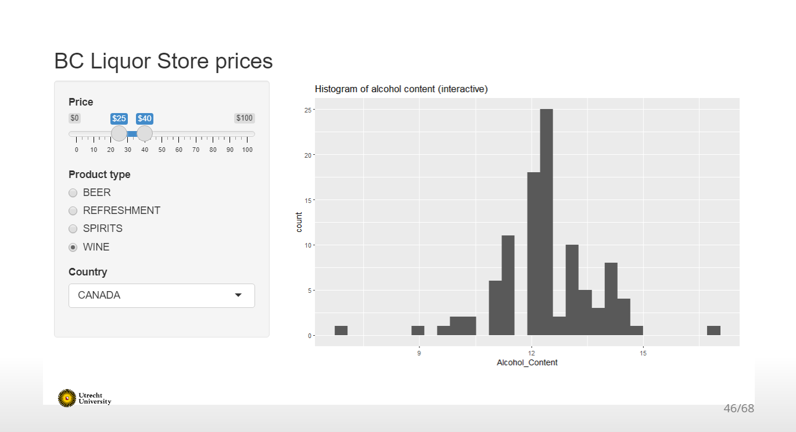
</div>


## Building the actual output 

To complete our app we need to build some output for the table placeholder, and add it to the server: 


```r
output$our_table <- renderTable({
  bcl %>%
    filter(Price >= input$priceInput[1],
           Price <= input$priceInput[2],
           Type == input$typeInput,
           Country == input$countryInput
    ) %>% 
    select(c("Name", "Price", "Type", "Country", "Alcohol_Content"))
})
```

## Our app

<div align="center">
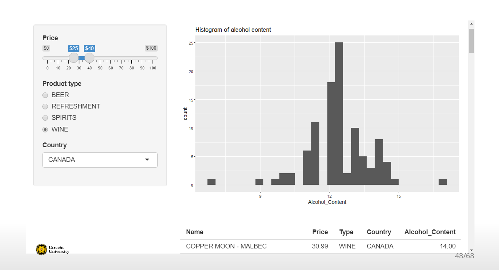
</div>


# Intermezzo

## Reactivity {.build}

Short break from our app to talk about a crucial concept in `shiny`: reactivity. 

Reactivity enables your outputs to react to changes in inputs. 

On the most basic level, it means that when the value of a variable `x` changes,  anything that relies on `x` (i.e. has `x` in it) gets re-evaluated. 

Consider the following code


```r
x <- 5
y <- x + 1
x <- 10
```

What is the value of `y`?

## Reactivity {.build}

What is the value of `y`?


```r
x <- 5
y <- x + 1
x <- 10
```

In ordinary programming, the value of `y` is still 6. 

In reactive programming, however, `x` and `y` are *reactive expressions*. Now, the value of `y` updates reactively, and becomes 11. 

Reactivity is the foundation for the responsiveness of `shiny` apps. 

## Reactivity

In our server, we implicitly use reactivity when we filter the data for our outputs: 


```r
bcl %>%
  filter(Price >= input$priceInput[1],
         Price <= input$priceInput[2],
         Type == input$typeInput,
         Country == input$countryInput
  )
```

Whenever one of the inputs changes, our outputs change with it. But, this part of code is duplicated, because we didn't use a reactive variable.  

## Reactivity {.build}

We can avoid code duplication by:

- defining a reactive variable that will hold the filtered dataset; 
- using that variable in the `render...()` functions.


```r
filtered <- reactive({
  bcl %>%
    filter(Price >= input$priceInput[1],
           Price <= input$priceInput[2],
           Type == input$typeInput,
           Country == input$countryInput
    )
})
```


## Reactivity {.build}

What is going on behind the scenes?

- The price input changes &rarr;
- `shiny` 'looks' at the reactive(s) that depend on price &rarr;
- `filtered()` is re-evaluated &rarr;
- `shiny` 'looks' at the reactive(s) that depend on `filtered()` &rarr;
- The two `render...()` functions are re-executed &rarr;
- The plot and the table output are updated.

This can be visualized in a dependency tree, to show what value depends on what other value.

## Reactivity

<div align="center">

</div>

# The server (continued)

## The final app


```r
server <- function(input, output) {
  filtered <- reactive({
    bcl %>%
      filter(Price >= input$priceInput[1],
             Price <= input$priceInput[2],
             Type == input$typeInput,
             Country == input$countryInput
      )
  })
  output$coolplot <- renderPlot({
    ggplot(filtered(), aes(Alcohol_Content)) +
      geom_histogram() +
      ggtitle("Histogram of alcohol content")
  })
  output$our_table <- renderTable({
    filtered() %>% 
      select(c("Name", "Price", "Type", "Country", "Alcohol_Content"))
  })
}
```

## Our app 

<div align="center">

</div>


## Advanced topics

Make your app more advanced:

- Change input element options from the server side with `update...()` functions;
- Use more complex layouts, such as tabs or dashboards;
- Modularize your app;
- Make the output elements 'clickable' with `plotly` and `datatable`.


# Take aways

## Tips

In general:

- Keep It Simple, Stupid;
- Don't rush into coding when you should be thinking;
- Use a design/UI-first approach;
- If you copy something just ONCE, make it a function;
- Avoid unnecessary complexity and 'feature creep'.

Before building a `shiny` app, think about:

- Who are the end users of your app? Are they tech-literate?
- In what context will the app be used? On what machines (e.g., because of screen size)? 

## Tips

Build the front-end and the back-end separately.

Front-end:

- Work on the general appearance first, anything that does not rely on computation (e.g., tabs, inputs, outputs);
- Use mock data and/or text (build an 'ipsum-app');
- Make the app self-evident; the main usage of the app should not require reading any manual.

## Tips 

Back-end:

- Use sensible non-reactive defaults while developing (e.g., `data <- mtcars` instead of `data <- reactive(...).`);
- Think about what could to be 'hard coded' in the final app too, because of the reactivity vs. speed trade-off;
- Extract the complex (but non-reactive) processing functions and put them in separate files;
- Add user feedback to make server-side requirements explicit (e.g., input validation, pop-up messages, loading icons).

## Tips

Deploy your app on [shinyapps.io](https://www.shinyapps.io/):

- You'll have a link to use/share the app online;
- With a free account, your app will be public;
- If your app is too popular, you will need to pay (for an upgrade that is, not automatically);
- Advanced: You can tweak your app to cache certain outputs, or have several users in one session (like Google Drive documents);

<div class="small"> Note: You could also host your app on your own website. Or don't deploy it at all (e.g., for privacy reasons).</div>

## Tips

If you want your Shiny app to last, you should make it robust:

- Run the app in the viewer panel, a separate window, and your browser;
- Monkey test it (i.e., click EVERYTHING);
- Provide the wrong inputs (e.g., a corrupt data file, a file with the 'wrong' extension, an 'impossible' numeric input, etc.);
- Advanced: Use the `golem` framework for production-grade `shiny` apps (but decide up-front!).

## Tips

Check out these amazing resources:

- [RStudio's introduction to shiny webinar](https://www.rstudio.com/resources/webinars/introduction-to-shiny/);
- Hadley Wickham's book [Mastering Shiny](https://mastering-shiny.org/);
- The official [cheatsheet](https://rstudio.com/resources/cheatsheets/);
- The more advanced [Engineering Shiny](https://engineering-shiny.org/);
- This webinar on [Modularizing Shiny](https://www.youtube.com/watch?v=ylLLVo2VL50).

And look for inspiration here:

- The [Shiny Gallery](https://shiny.rstudio.com/gallery/);
- The annual `shiny` [contest](https://www.rstudio.com/blog/winners-of-the-2nd-shiny-contest/);
- For example, [this app](https://www.rstudio.com/blog/winners-of-the-2nd-shiny-contest/) for creating `R` package hex stickers.

## Check out my app!

<div align="center">

[hanneoberman.shinyapps.io/shinymice-demo/](https://hanneoberman.shinyapps.io/shinymice-demo/)
</div>


## Final remarks and conclusions

- `shiny` allows you to build interactive (web) apps from `R`; 
- `shiny` apps consist of two parts, the user interface (UI) and the server:
    - In the UI, you design what is shown to the user,
    - In the server, you do all the modeling and building of the outputs,
    - You link the UI and the server to make the app interactive,
    - To optimize these interactions, you can use reactive expressions;
- This is only the tip of the iceberg, there are many more things you can do with `shiny`;
- Good luck with your assignment!
