## Attribution and reuse 

{fig-align="left" width="30%"}

::: {.smaller}

This work is licensed under a [Creative Commons Attribution-ShareAlike 4.0 International License](https://creativecommons.org/licenses/by-sa/4.0/) (CC BY-SA4.0).

These materials have been developed in part by [Hanne Oberman](https://hanneoberman.github.io/), [Shannon Pileggi](https://github.com/rstats-wtf/wtf-debugging-slides), [Jon Harmon](https://github.com/r4ds/bookclub-advr), and [Danielle Navarro](https://djnavarro.net/slides-project-structure).

When using these materials, you *must* ensure that the content is not used for generative AI model training.
<br>
:::

```{r, echo=FALSE}
library(countdown)
```

```{r font-awesome-color, echo=FALSE}
# fill for font awesome icons
fa_fill <- "#FFCD00"
```

## Computer bugs

:::: columns

::: {.column width="50%"}

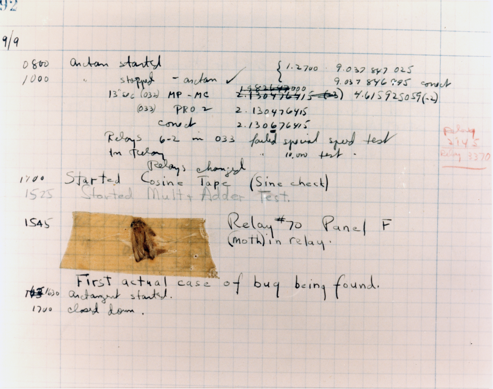
:::

::: {.column width="45%"}

::: fragment

:::

:::

::::

::: footer
[Grace Hopper (1947)](https://en.wikipedia.org/wiki/Grace_Hopper)
:::

## Bugs in R

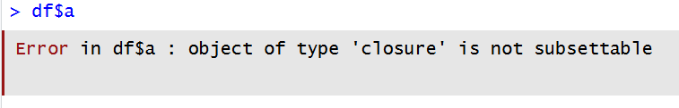

::: fragment
Explanation: `df` is a closure, in this case, the function `stats::df()`, the density of $F$-distribution.

(It is not a data frame, as you thought it was, ha!)

It does not have elements that you could subset. 
:::


## Learning objectives:

- Overall: Find and fix errors.
- Locate exactly where an error occurred with the `traceback()` function.
- Pause the execution of a function and launch an environment to interactively explore what's happening.
- Debug non-interactively executed code.
- Recognize other (non-error) problems that occasionally also need debugging.

# Preventing errors {background-color="#FFCD00"}

::: fragment

> The best way to deal with errors is not to have any at all

:::

## Use an IDE

Popular [IDEs](https://en.wikipedia.org/wiki/Integrated_development_environment) for R:

-   **RStudio**: Ideal for R programming with features tailored for data analysis and visualization
-   **Positron**/**Visual Studio Code (VS Code)**: A versatile code editor with a vast ecosystem of extensions for various languages
<!-- -   **Eclipse (with StatET)**: Eclipse StatET is an integrated development environment (IDE) for R, offering features for R programming and data analysis -->

::: fragment
$\rightarrow$ visual feedback (e.g., rainbow parentheses)

$\rightarrow$ use [tab] for code completion

```r
seq(1, 10)
```
:::


## Code style and naming

- Keep your code clear and legible with a [code style](https://style.tidyverse.org/) <br>
  $\rightarrow$ Auto-format using [ctrl]/[cmd] + [shift] + A
- Adhere to naming conventions/rules
  - Object names in R cannot start with a digit and cannot contain certain other characters such as a comma or a space
  - Adopt a [convention](https://en.wikipedia.org/wiki/Snake_case) for demarcating words in names

:::fragment
```r
i_use_snake_case
other.people.use.periods
evenOthersUseCamelCase
```
:::


::: fragment
  $\rightarrow$ [tab] for code completion

```r
this_is_a_really_long_name <- 2.5
```
:::


## Always start with a blank slate

- Code in a fresh R session
- Load only the necessary packages and objects
- Save objects for code that takes a long time to execute

::: fragment
``` r
saveRDS(my_precious, here("results", "my_precious.rds"))
```
:::

- Access previously saved objects

::: fragment

``` r
my_precious <- readRDS(here("results", "my_precious.rds"))
```
:::

## File naming {.nonincremental}

Some file names are good ✅

- reading01_shakespeare_romeo-and-juliet_act01.docx
- reading01_shakespeare_romeo-and-juliet_act02.docx
- reading02_shakespeare_othello.docx
- reading19_plath_the-bell-jar.docx

::: fragment
Other file names are bad ❌

- Romeo and Juliet Act 1.docx
- Shakespeare RJ act2.docx
- shakespeare othello I think?.docx
- belljar plath (1).docx
:::

## Three principles for file naming

- Be nice to machines
- Be nice to humans
- Make sorting and searching easy

## Names machines like

- Don't leave white space
  - Machines sometimes get confused by spaces
  - ✅ romeo-and-juliet_act01.docx <br>
    ❌ romeo and juliet act 1.docx
    
<!-- - Easier to write code when files don't have spaces -->

- Only use letters, numbers, hyphens and underscores
  - Don't assume case is meaningful (some operating systems treat `a` and `A` the same)
  - Machines sometimes get confused by special characters
  - If you can, avoid accents `ñ` (but consider accessibility!)
  - ✅ essay_romeo-and-juliet_draft01.docx <br>
    ❌ essay "romeo and juliet" draft01(1).docx

  <!-- - Some characters have special meaning, e.g., `^.*?+|$` -->

## Names machines like

- Use separator characters
  - Use hyphen `-` to mean "different words that are part of the same chunk"
  - Use underscore `_` to separate different chunks
  - Chunks: [`identifier`] [`author`] [`title`] [`section` (optional)]
  - ✅ reading01_shakespeare_romeo-and-juliet_act01.docx
  - ✅ reading01_shakespeare_romeo-and-juliet_act02.docx
  - ✅ reading02_shakespeare_othello.docx
  - ✅ reading19_plath_the-bell-jar.docx

## Names humans like

- Love the slug 🐌

  - "analysis01_**descriptive-statistics**.R"
  - "analysis02_**preregistered-analysis**.R"
  - "notes01_**realising-the-problem**.txt"
  - "analysis03_**departing-from-the-plan**.R"
  - "notes02_**tentative-write-up**.docx"

- Concise, meaningful description
- Usually appended to the end

## Easy to sort and search names

- File names sometimes need to include dates
- ... but these dates don't sort in chronological order

  - 1-April-2012.R
  - 1-Jan-2009.R
  - 12-Jan-2012.R
  - 2-Jan-2012.R

- Happily, these dates do! 

  - 2009-01-01.R
  - 2012-01-01.R
  - 2012-01-02.R
  - 2012-04-01.R

<!-- - Dates should follow the YYYY-MM-DD format -->
<!--   - Known as the ISO 8601 standard -->

<!-- ::: fragment -->
<!-- 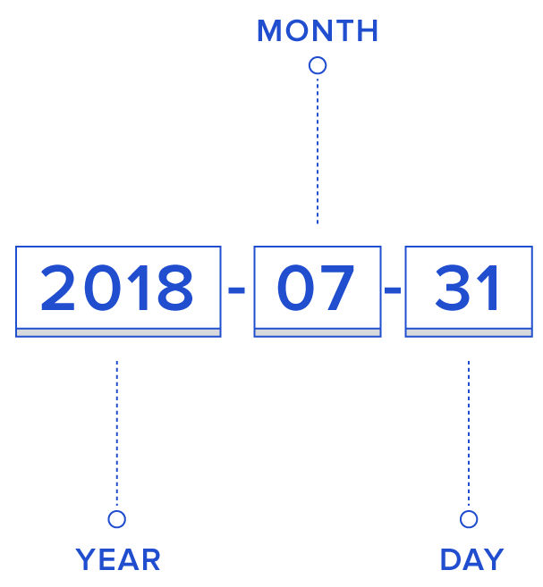{fig-align="right"} -->
<!-- ::: -->

## Easy to sort and search names

{height="80%"}

<!-- https://xkcd.com/1179/ -->

## Easy to sort and search names {.nonincremental}

- Use numbers as a prefix to order files 

  - 01_preface.docx
  - 02_introduction.docx
  - 03_method.docx
  - etc...
  - 19_appendix-09.docx
  - 20_appendix-10.docx
  - 21_appendix-11.docx

- Left pad with 0 so that all numbers have same length
- Numbers are more robust than letters (alphabetical order varies)

## Three principles 

- Be nice to machines
- Be nice to humans
- Make sorting and searching easy

## Use an explicit project structure

```r
setwd("path/that/only/works/on/my/machine")
```

- Use R project (`.Rproj`) files to organize your files
  - No more need for `setwd()`
  - All relative paths from `.Rproj` file

- Use `here::here()`
  - Create paths relative to the R script
  - Grab files from folders inside top-level directory `here("data", "file_i_want.csv")`

## File paths {.nonincremental}

Three files inside one folder

- 📂 project
  - 📄 01_initial-plan.docx
  - 📄 02_data-collection.R
  - 📄 03_initial-analysis.R

::: fragment
The "file paths" are written like this

`project/01_initial-plan.docx` <br>
`project/02_data-collection.R` <br>
`project/03_initial-analysis.R`
:::

## File paths {.nonincremental}

Three files inside one folder

::: nonincremental
- 📂 project
  - 📄 01_initial-plan.docx
  - 📄 02_data-collection.R
  - 📄 03_initial-analysis.R
:::

Except on Windows... 

`project\01_initial-plan.docx` <br>
`project\02_data-collection.R` <br>
`project\03_initial-analysis.R`

## File tree {.nonincremental .smaller}

<!-- Folders inside folders creates a "file tree"... -->

::: {{.nonincremental}}

- 📂 project
  - 📄 overview.docx
- 📂 data
  - 📄 data_ex01.csv
  - 📄 data_ex02.csv
- 📂 analysis
  - 📄 ex01_01_descriptive-statistics.R
  - 📄 ex01_02_inferential-statistics.R
  - 📄 ex02_01_descriptive-statistics.R
  - 📄 ex02_02_inferential-statistics.R
- 📂 report
  - 📄 2021-03-11_report_getting-started.docx

:::

## File tree {.nonincremental}

<!-- Paths for all files in this tree -->

  - `project/overview.docx`
  - `project/data/data_ex01.csv`
  - `project/data/data_ex02.csv`
  - `project/analysis/ex01_01_descriptive-statistics.R`
  - `project/analysis/ex01_02_inferential-statistics.R`
  - `project/analysis/ex02_01_descriptive-statistics.R`
  - `project/analysis/ex02_02_inferential-statistics.R`
  - `project/report/2021-03-11_report_getting-started.docx`

## But what if


::: footer
<https://giphy.com/gifs/TreehouseDirect-agent-binky-8UabbehIqkR0akDt1y>
:::


# Strategies for finding and fixing errors {background-color="#FFCD00"}

:::: fragment

> Debugging is like being the detective in a crime movie where you're also the murderer. 

::: {style="text-align: right;"}
**-Filipe Fortes**
:::

::::

## Types of errors

- Parsing errors: you are missing a closing `)`, `}` or `"` 
  so the code [AST](https://en.wikipedia.org/wiki/Abstract_syntax_tree) cannot even be formed
     * Usually captured by [IDE](https://nl.wikipedia.org/wiki/Integrated_development_environment)s such as RStudio and Positron with red flashing pointers
- Syntax errors: 
     * Parentheses are matched but one of them closes at wrong time
     * The name of a function input is misspelled
     * Passing more inputs to a function than it expects
- Runtime errors: the code is syntactically correct, but it does a weird thing
  in your actual environment with your actual data

## Common syntax errors

[Longer list here](https://computing.stat.berkeley.edu/tutorial-R-debugging/#4-some-common-causes-of-bugs)

- Parenthesis mismatches

- `[[...]]` vs. `[...]`

- `==` vs. `=`

- Comparing real numbers exactly using `==` after calculations that result in non-integers

- Type coercion and dropping dimensions

::: fragment
```{r drop_class1, echo=TRUE}
inherits(mtcars[,1], "data.frame")
```
:::

::: fragment
```{r drop_class2, echo=TRUE}
inherits(mtcars[,1, drop=FALSE], "data.frame")
```
:::

## More common syntax errors

- You expect a single value but your code gives you a vector

::: fragment 

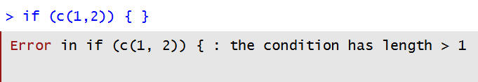
:::

::: fragment

$\rightarrow$ you may need `identical()` or `all()`, or form the condition more thoroughly

:::


## Troubleshooting

1.  **SEARCH** <br> *Teach Me How To Google*, Samantha Csik (2022) <br> [slides](https://samanthacsik.github.io/teach-me-how-to-google/slides/RLadiesSTL-2022-02-22.html#1), [recording](https://youtu.be/93WsFQUuxvA)

2.  **RESET** <br> Restart R, especially when things get weird.

3.  **REPREX** <br> *make a reprex..... please*, Sharla Gelfand (2021) <br> [slides](https://make-a-reprex-please.netlify.app/#1), [recording](https://www.youtube.com/watch?v=G5Nm-GpmrLw), <https://reprex.tidyverse.org/>

4. **AI** (optional) <br> Claude, ChatGPT, etc.

## 1. Search first!

- Read the docs (e.g., `??`, or `usethis::browse_package()`)
- Google new error messages to help translate
- Find other instances of the error on the web (e.g., GitHub Issues, `usethis::browse_github()`, or StackOverflow)
- Packages that help:
  - [{errorist}](https://r-pkg.thecoatlessprofessor.com/errorist/)
  - [{searcher}](https://r-pkg.thecoatlessprofessor.com/searcher/)
  - Probably AI agents after 2026

## 2. Resetting R {.nonincremental}

<brshort>

::: r-fit-text
Have you tried turning it `OFF` and `ON` again?
:::

<brshort>

:::::: {.nonincremental}

::::: columns
::: {.column width="50%"}
`Session -> Restart R` or

- Ctrl + Shift + F10 (Windows),

- Cmd + Shift + 0 / Cmd + Shift + F10 (Mac)
:::

::: {.column width="50%"}

::: fragment
`usethis::use_blank_slate()`

or `Tools -> Global Options -> Workspace`

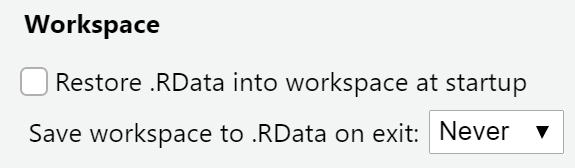
:::
:::
:::::
::::::

## Why reset?

*Which persist after `rm(list = ls())`?*

| Option | Persists? |
|-----------------------------------------------------|-------------------|
| A. `library(dplyr)` | `r fontawesome::fa("check", fill = "white")` |
| B. `summary <- head` | `r fontawesome::fa("xmark", fill = "white")` |
| C. `options(stringsAsFactors = FALSE)` | `r fontawesome::fa("check", fill = "white")` |
| D. `Sys.setenv(LANGUAGE = "fr")` | `r fontawesome::fa("check", fill = "white")` |
| E. `x <- 1:5` | `r fontawesome::fa("xmark", fill = "white")` |
| F. `attach(iris)` | `r fontawesome::fa("check", fill = "white")` |

```{r}
countdown(
  minutes = 2
  )
```

## Why reset?

*Which persist after `rm(list = ls())`?*

| Option | Persists? |
|-----------------------------------------------------|-------------------|
| A. `library(dplyr)` | `r fontawesome::fa("check", fill = fa_fill)` |
| B. `summary <- head` | `r fontawesome::fa("xmark", fill = "white")` |
| C. `options(stringsAsFactors = FALSE)` | `r fontawesome::fa("check", fill = fa_fill)` |
| D. `Sys.setenv(LANGUAGE = "fr")` | `r fontawesome::fa("check", fill = fa_fill)` |
| E. `x <- 1:5` | `r fontawesome::fa("xmark", fill = "white")` |
| F. `attach(iris)` | `r fontawesome::fa("check", fill = fa_fill)` |

## `rm(list = ls())`

- 'object-nuking' command: delete user-created objects from the global workspace
- makes your script vulnerable to hidden dependencies
  - loaded packages
  - settings such as `stringsAsFactors`
  - relative paths
- deceptive 'reproducibility'

::: fragment

Instead, save objects, reset and/or use `sessioncheck()`

```{r}
#| echo: true
#| message: true
#| warning: true
sessioncheck::sessioncheck()
```

:::

## Your turn, exercise 00

<!-- Either on your Posit cloud workspace or your personal computer... -->

<brshort>

::: question
Set your Workspace options as shown.
:::

`usethis::use_blank_slate()` or

`Tools -> Global Options -> Workspace`

:::: columns
::: {.column width="50%"}

:::
::::

```{r}
countdown(
  minutes = 2,
  # Fanfare when it's over
  play_sound = TRUE,
  # Set timer theme to match solarized colors
  color_border              = "#FFFFFF",
  color_text                = "#7aa81e",
  color_running_background  = "#7aa81e",
  color_running_text        = "#FFFFFF",
  color_finished_background = "#ffa07a",
  color_finished_text       = "#FFFFFF",
  font_size = "2em",
  )
```


## 3. Repeatable bugs are more debuggable

- May need to execute many times
- Up-front investment to make a [{reprex}](https://reprex.tidyverse.org/) pays off
- A **re**producible **ex**ample is a minimal and self-contained code snippet that shows exactly what happened when the code was run
  - Is the example minimal? Remove unrelated code and data, etc.
  - Is it self‑contained? All libraries loaded, seeds set, data available, etc.

::: fragment
{fig-align="right" width="17%"}

:::

## The `reprex()` function

- `reprex()` records:
  - the R expressions you pass (or the selected code in RStudio)
  - the console output, messages, warnings, and plots
  
- The minimal, self‑contained snippet speeds up diagnosing problems
- The output can be copied directly into forums, issue trackers, research and teaching materials
- It enforces the reproducibility principle: anyone who receives the snippet can run it on their own machine and obtain the exact same result

## A `reprex`

```{r,error=TRUE, echo=TRUE}
A <- 1:3
mean(A)
```

::: fragment

```{r,error=TRUE, echo=TRUE}
mean(a)
```
:::

<br>

::: fragment

```{r, eval=FALSE, echo=TRUE}
reprex::reprex()
```
:::

<br>

::: fragment
``` r
A <- 1:3
mean(A)
#> [1] 2
mean(a)
#> Error:
#> ! object 'a' not found
```

<sup>Created on 2026-09-24 with [reprex v2.1.1](https://reprex.tidyverse.org)</sup>
:::

## Use the scientific method to identify bugs

- Generate a hypothesis.
- Design experiments to test that hypothesis.
- Record your results.

. . . 

Being systematic often saves time in the end.


# Debugging in practice {background-color="#FFCD00"}

<!-- # Debugging your code -->

::: fragment

> Finding your bug is a process of confirming the many things that you *believe* are true — until you find one which is *not* true.

::: {style="text-align: right;"}
**—Norm Matloff** (emphasis added)
:::

:::
<!-- Getting started -->

<!-- Troubleshooting -->

<!-- Moving on -->

<!-- Debugging your code -->

<!-- Debugging in RStudio -->

<!-- Debugging their code -->

<!-- Special cases -->

<!-- Read the source -->

<!-- # Getting started -->


## Checklist

<br>

`r fontawesome::fa("check", fill = fa_fill)` R installed? Pretty recent?

$\rightarrow$ Recommended R ≥ 4.4.0

`r fontawesome::fa("check", fill = fa_fill)` RStudio installed?

$\rightarrow$ I'm on 2026.08.1+195

<br>

Optional: 

`r fontawesome::fa("check", fill = fa_fill)` Ready to build packages?

$\rightarrow$ `devtools::has_devel()`<br> $\rightarrow$ *Your system is ready to build packages!*


## Sourcing

<br>

⚠️ name your script with functions

<brshort>

⚠️ source your script with functions

<brshort>

for the best debugging experience 😎

<br>

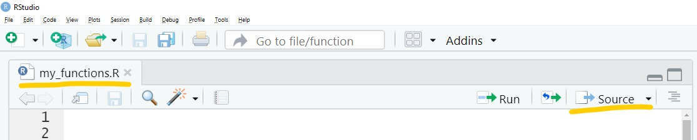

<!-- # Moving on -->

<!-- <br> -->

<!-- ::: r-fit-text -->
<!-- from troubleshooting to... -->
<!-- ::: -->

<!-- <brshort> -->

<!-- ::: r-fit-text -->
<!-- formal `debugging` techniques. -->
<!-- ::: -->


## Key concepts

<br>

`r fontawesome::fa("road", fill = "black")` traceback

$\rightarrow$ `location` where did the error occur

<br>

`r fontawesome::fa("bug", fill = "black")` interactive debugger

$\rightarrow$ `context` why did the error occur

<br>

`r fontawesome::fa("magnifying-glass", fill = "black")` your code vs `r fontawesome::fa("hat-wizard", fill = "black")` their code

::: notes
interactive debugging: pause the execution of a function and launch environment where you can interactively explore what's happening
:::

## Debugging tools

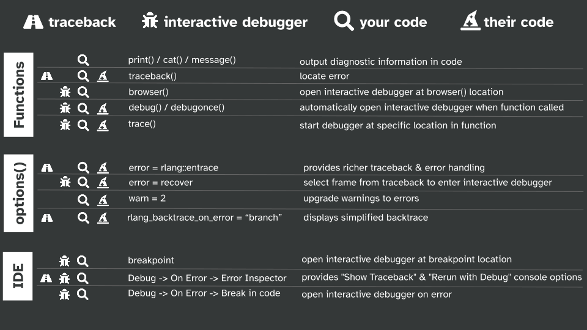

::: notes
source for image in google slides at

https://docs.google.com/presentation/d/14mqGirw4TnblqSFY0Tk30YrxkAwIrz1xo4nMIwgqk_o/edit?u sp=sharing
:::

## 

::: r-fit-text
This is a lot.
:::

. . .

<br>

These tools achieve similar objectives slightly differently.

<br>

People don't generally use *all* of these tools at once. They pick and choose the ones they like.


# Debugging `r fontawesome::fa("magnifying-glass", fill = "black")` your code 

## Debugging *your* code

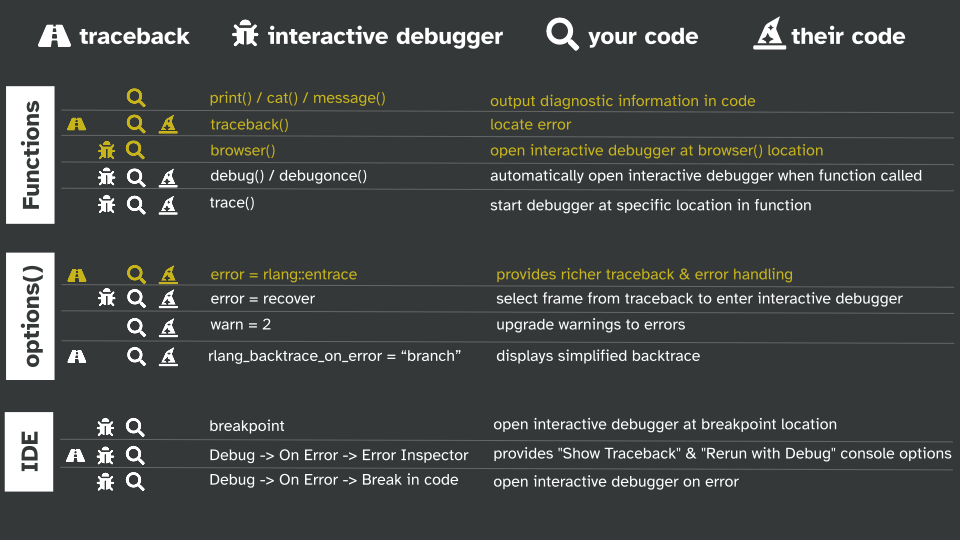

## Set up

<br>

```{r, echo = TRUE, error = TRUE}
f <- function(x) {
  x + 1
}

g <- function(x) f(x)

g("a")
```


# `r fontawesome::fa("road", fill = "black")` traceback

<!-- Use `traceback()` to locate the error -->


## traceback()

<br>

```{r, eval=FALSE, echo=TRUE, error = TRUE, `code-line-numbers`="3"}
source("demo/my_functions.R")
g("a")
traceback()
```

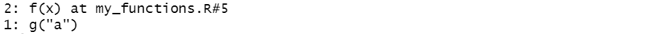

<br>

shows the sequence of calls that lead to the error.

::: notes
used interactively in console, called for last error observed
:::

::: footer
the trace back is also known as: <br> call stack, stack trace, & back trace
:::

## Richer traceback

<br>

```{r, eval=FALSE, echo=TRUE, error = TRUE, `code-line-numbers`="5"}
source("demo/my_functions.R")
options(error = rlang::entrace) 
g("a")
rlang::last_trace()
```

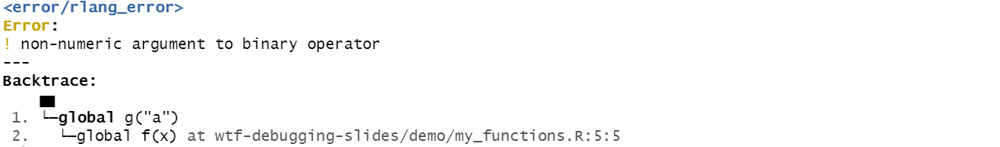

<br>

`options(error = rlang::entrace)` <br> could go in your `.Rprofile`


## Example: Chained functions

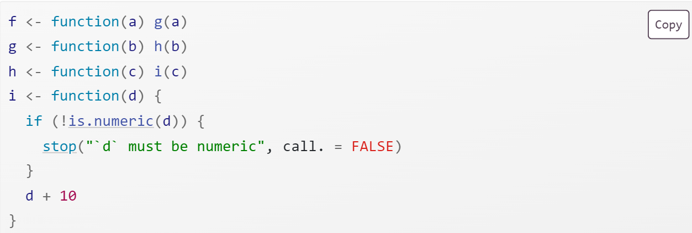

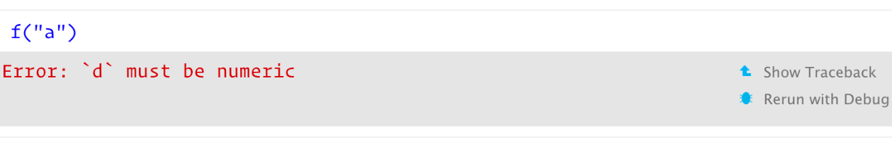

## `traceback()` shows the call stack that lead to the error 

Click **"Show traceback":**:
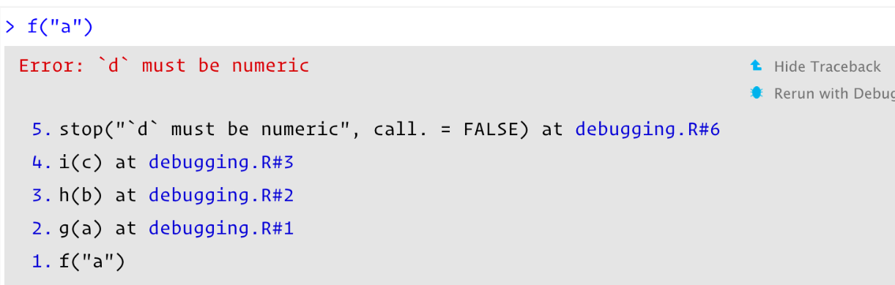

Read bottom to top.

::: notes
- `f()` calls `g()` calls `h()` calls `i()`
- `rlang::global_handle()` for better traceback.
:::

## traceback vs rlang functions

<br>

- Call stacks printed by `traceback()`, `browser()` & `where`, and `recover()` are not consistent
- Numbering and ordering differs between `traceback()` and rlang functions.

<brshort>

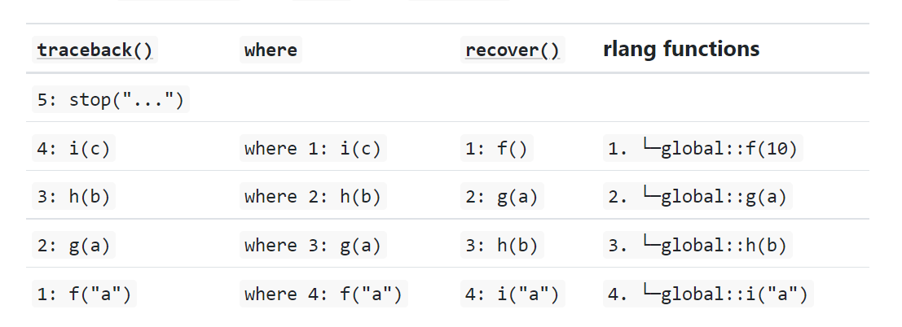

::: footer
<https://adv-r.hadley.nz/debugging.html#call-stack-ordering>
:::

## traceback vs rlang functions

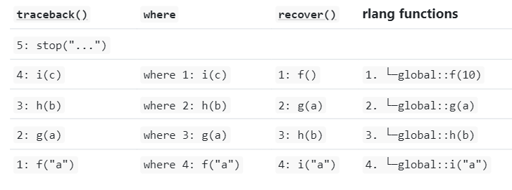

- RStudio displays calls in the same order as `traceback()`
- {rlang} functions use the same ordering & numbering as `recover()`

## `traceback()` limits

In real world, traceback may look like [25 layers](https://stbl.wrangle.zone/dev/reference/expect_pkg_error_classes.html)

- Your code is the first 2-3 layers.
- The last 5 layers are very clearly formatting the error and making a safe return of appropriate objects.
- The middle 15 layers are classes and methods of `dplyr`, `rlang`, `purrr` and `base` 
  and maybe packages you have never heard of,
  passing very opaque things to one another, 
  your informatively named objects are abstracted somewhere
  in `...`, `.x` and `envir`...
- ... and you are still left wondering what's going on.

<!-- ## `rlang::global_handle()` in `.Rprofile` makes traceback better -->

<!-- 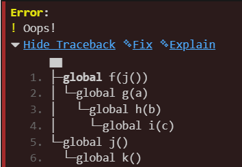 -->

<!-- ::: notes -->
<!-- - `rlang::with_abort()` from book no longer exists -->
<!-- - I'm now experimenting with turning this off, because it breaks "rerun with debug"! -->
<!-- ::: -->

# `r fontawesome::fa("bug", fill = "black")` interactive debugger

<!-- Interactive debugger -->

## browser()

```{r, eval=FALSE, echo=TRUE, `code-line-numbers`="2"}
f <- function(x) {
  browser()
  x + 1
}

g <- function(x) f(x)
```

<br>

`browser()` opens the interactive debugger.

1.  Modify the function by inserting a `browser()` statement.

2.  Source the function.

3.  Execute the function.

<!-- ## Use `browser()` to set a break point in code -->

<!-- 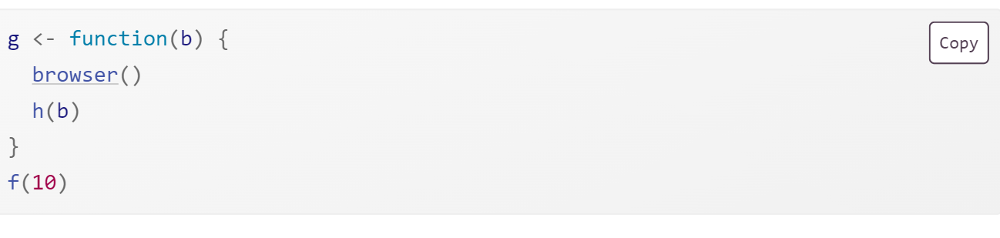 -->


## Interactive debugger

Use `browser()` to set a break point in code

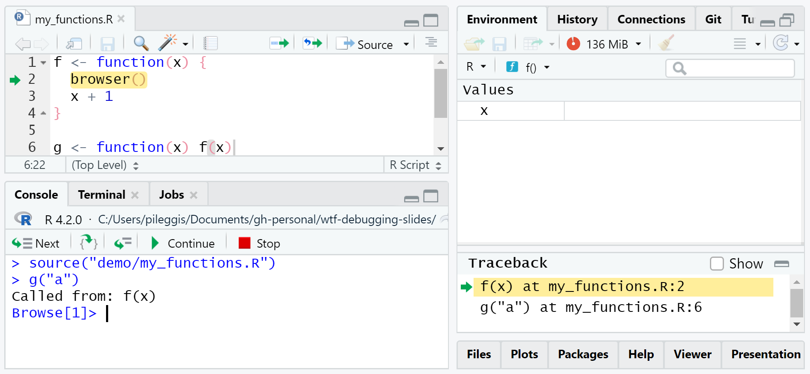

## `browser()` provides special commands

These commands work in the Console; RStudio also makes the toolbar buttons available.

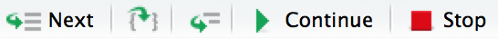

- Next (`n`): Execute the next step
- Step into (`s`): Dive into function (or `n`)
- Finish (`f`): Finish execution of the current loop/function
- Continue (`c`): Continue regular execution of the function (leave interactive) 
- Stop (`Q`): Stop debugging, terminate the function, and return to the global workspace 

## Interactive debugger overview

::::::: columns
::: {.column width="35%"}
Investigate objects

`ls()`, `ls.str()`,<br> `str()`, `print()`
:::

::: {.column width="5%"}
:::

:::: {.column width="60%"}
Control execution

::: small
| command | operation                              |
|---------|----------------------------------------|
| `n`     | next statement                         |
| `c`     | continue (leave interactive debugging) |
| `s`     | step into function call                |
| `f`     | finish loop / function                 |
| `where` | show previous calls                    |
| `Q`     | quit debugger                          |
:::
::::
:::::::


## `browser()` practical tips

- RStudio runs its best attempt to show the code that is being executed in the "Source" pane
    * parsed [AST](https://en.wikipedia.org/wiki/Abstract_syntax_tree) for external functions (no comments, no indents);
    * actual source files within your packages when you are in the package project.
- That means you can select the code and `Ctrl+Enter` to execute it
    * if in doubt about the source of the error, do that rather than hitting `n` "Next"
    * especially if the computations leading to this point in your code are costly in terms of time


## Debugging your code


## Your turn, exercise 01

Download the exercises 

- with `usethis::use_course("rstats-wtf/wtf-debugging")`, or 
- download the zip folder from <https://github.com/rstats-wtf/wtf-debugging>

<brshort>

<!-- Check out the `README.md` for some getting started tips! -->

::: fragment
Complete 01_exercise to practice debugging your own code.
:::

::: small

- `01_debugging_spartan.R` (directions to explore without suggested code)

- `01_debugging_comfy.R` (directions to explore with suggested code)

- `01_debugging_solution.R` (directions to explore with code solutions)
:::

```{r}
countdown(
  minutes = 15,
  # Fanfare when it's over
  play_sound = TRUE,
  # Set timer theme to match solarized colors
  color_border              = "#FFFFFF",
  color_text                = "#7aa81e",
  color_running_background  = "#7aa81e",
  color_running_text        = "#FFFFFF",
  color_finished_background = "#ffa07a",
  color_finished_text       = "#FFFFFF",
  font_size = "2em",
  )
```

::: footer

<https://github.com/rstats-wtf/wtf-debugging>

:::


<!-- # Debugging in RStudio -->

## Debugging in RStudio

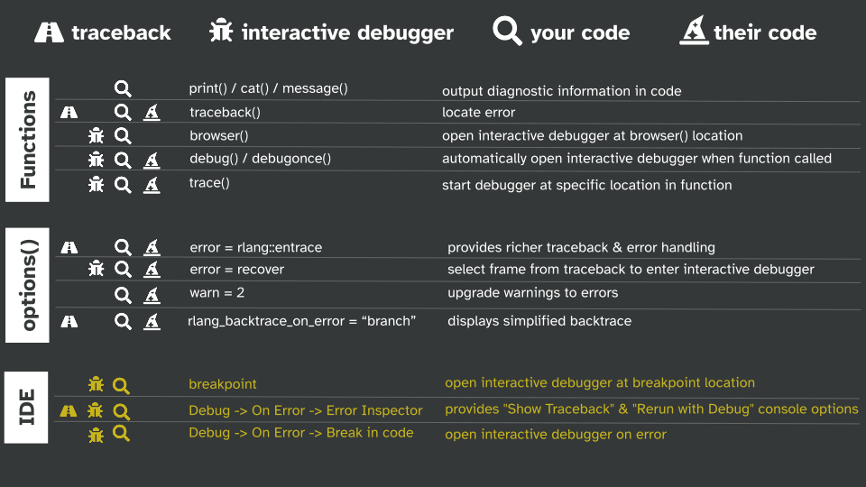


## RStudio has tools for debugging

- Click "Rerun with Debug" in error message
- Enable `Debug > On Error > Break in Code` to always jump to error

## Set breakpoints in RStudio for virtual `browser()`

Activate:

- Click to left of line number, or
- Press **Shift + F9**

. . . 

Downsides:

- Fail in [unusual situations](https://support.posit.co/hc/en-us/articles/200534337-Breakpoint-Troubleshooting)
- Can't be conditional

## Editor breakpoints

red circle = breakpoint = `browser()`

(but you don't have to change your code)

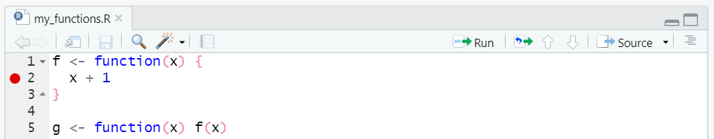

. . .

Set / re-set an editor breakpoint:

- click to the left of the line number in the source file

- press Shift+F9 with your cursor on the line

## Editor breakpoints

red circle = breakpoint = `browser()`

(but you don't have to change your code)


To activate, either

- click IDE Source button, or

- `debugSource(`"demo/my_functions.R"`)`

## Debugging console

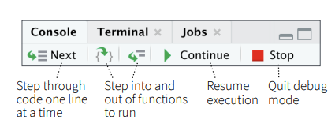

::: footer
RStudio IDE cheatsheet

<https://www.rstudio.com/resources/cheatsheets/>
:::

## IDE on error

:::::: columns
::: {.column width="45%"}
Automatically invoke actions on error.

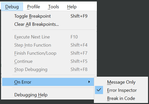
:::

:::: {.column .fragment width="55%"}
New set up for demonstration.

```{r, echo=TRUE, eval=TRUE, error=TRUE}
f <- function(x) { strsplit(x, ",") }
g <- function(x) { f(x) }
g("a,b")
```

<br>

::: fragment
```{r, echo=TRUE, eval=TRUE, error=TRUE}
g(factor("a,b"))
```
:::
::::
::::::

## IDE message only

<br>


## IDE error inspector

<br>

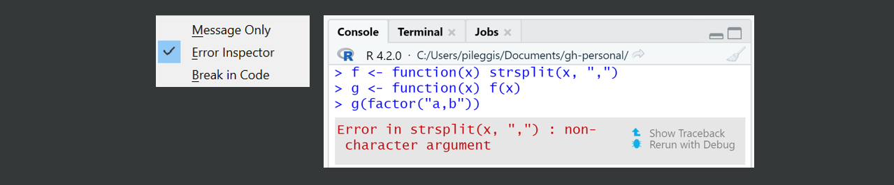

## IDE break in code

<br>

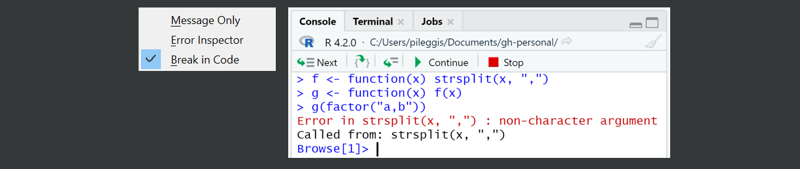

## Error inspector

:::::: columns
::: {.column width="58%"}
```{r, echo=TRUE, eval=FALSE}
# IDE Error Inspector not triggered
f <- function(x) x + 1
g <- function(x) f(x)
g("a")

# IDE Error Inspector not triggered
strsplit(factor("a,b"), ",")

# IDE Error Inspector not triggered
f <- function(x) strsplit(x, ",")
f(factor("a,b"))

# IDE Error Inspector yes triggered
g <- function(x) f(x)
g(factor("a,b"))

```
:::

::: {.column width="5%"}
:::

::: {.column width="35%"}
<br> The error inspector is only invoked if `your` `code` is involved.
:::
::::::

::: footer
To have RStudio invoke the debugger on any error,

`Tools -> Global Options -> General -> Advanced -> Debugging`

*uncheck* `Use debug error handler only when my code contains errors.`
:::


## Debugging in the RStudio IDE


## Your turn, exercise 02

<br>

::: question
Complete 02_exercise to practice debugging a slightly different version of your own code, using features from the RStudio IDE.
:::

```{r}
countdown(
  minutes = 7
  )
```

::: footer
<https://github.com/rstats-wtf/wtf-debugging>
:::

<!-- # Debugging *their* code -->

<!-- # `r fontawesome::fa("magnifying-glass", fill = "black")` your code vs `r fontawesome::fa("hat-wizard", fill = "black")` their code -->

# Debugging `r fontawesome::fa("hat-wizard", fill = "black")` their code

## Debugging *their* code

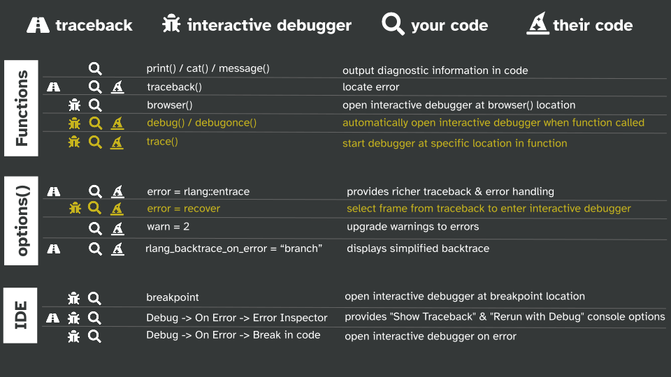

## debug()

`debug()` = `browser()`/ `breakpoint` in first line of function

```{r, eval=FALSE, echo=TRUE,`code-line-numbers`="4,7"}
# source if code is yours, otherwise not necessary
source("demo/my_functions.R")
# set debugging flag
debug("g")
g("a")
# turn off debugging flag
undebug("g")
```

. . .

- interactive debugger is initiated every time `g()` is executed, until `undebug("g")`

- depending on function internals, this can... trap you in the debugger 😬

## debugonce()

`debugonce()` = `browser()`/ `breakpoint` in first line of function

```{r, eval=FALSE, echo=TRUE,`code-line-numbers`="4"}
# source if code is yours, otherwise not necessary
source("demo/my_functions.R")
# set debugging flag
debugonce("g")
g("a")
```

- one time only!

- interactive debugger initiated a **single** time when `g()` is executed

`debug(fn_name)` to insert `browser()` in first line of `fn_name()`

- `undebug(fn_name)` to remove it
- `debugonce(fn_name)` to do it once (similar to rerun with debug) 
- `utils::setBreakpoint("file_name", line_number)`

::: notes
- Pronounce `debugonce()` [like "Beyonce"](https://www.youtube.com/watch?v=JThd3YYQXGg)
:::

## options(error = recover)

`r fontawesome::fa("check", fill = fa_fill)` we already discussed <br> `options(error = rlang::entrace)`<br> for a richer traceback on error

<br>

🤠 `options(error = recover)`

1.  displays an interactive prompt with frames

2.  you select the frame to enter the debugger


## Use `options(error = recover)` for interactive debugging prompt

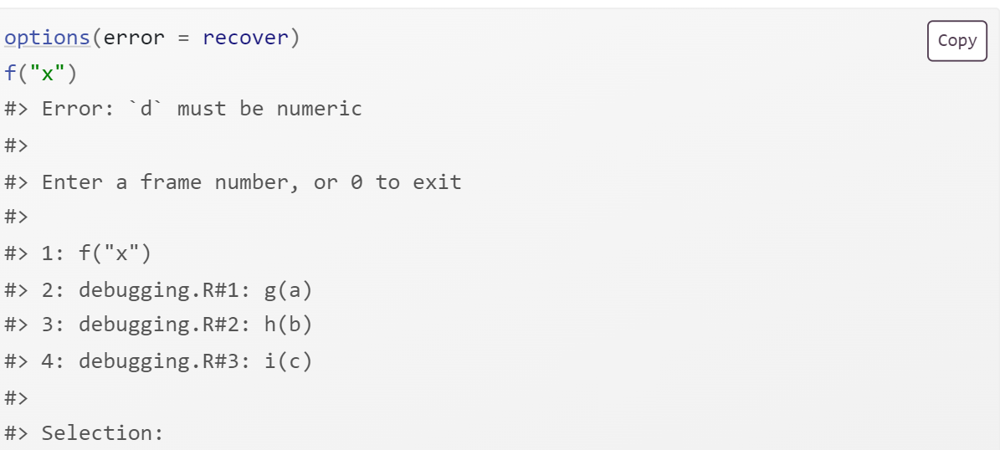

Turn off with `options(error = NULL)`

## recover example

```{r, eval=FALSE, echo=TRUE,`code-line-numbers`="2"}
source("demo/my_functions.R")
options(error = recover)
g("a")
options(error = NULL)
```

<br>

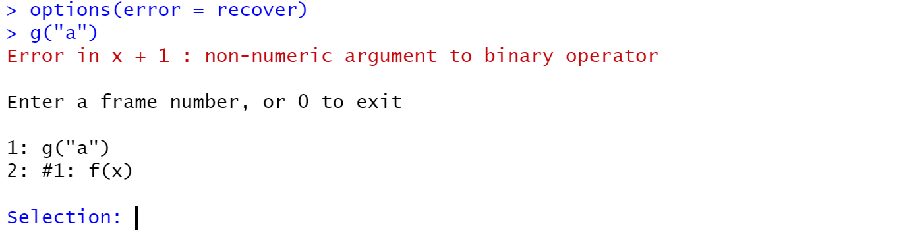

## trace() overview

`trace(what = fun, tracer = browser)` <br> is equivalent to

- inserting `browser()` in first line of function

- `debug(fun)`

. . .

you an also insert *any* code at *any* location in function

- `trace(what = fun, tracer = browser, at = 2)` <br>inserts `browser()` at second step of `fun`

. . .

`untrace(fun)` cancels the tracing

::: notes
`trace()` is a more flexible version of `debug()`

⚠️ `trace()` requires `{` in function definition
:::

## trace() without a specified step

<br>

```{r, eval=FALSE, echo=TRUE,`code-line-numbers`="1,4"}
trace(what = colSums, tracer = browser)
colSums(1:3)
# ls.str() in browser
untrace(colSums)
```

<br>

`trace(what = colSums, tracer = browser)` <br> is equivalent to

- inserting `browser()` in first line of `colSums` <br> if we had the source code

- `debug(colSums)`

## navigating function steps

<br>

investigate 🧐 the function with `as.list()` + `body()`

<brshort>

```{r, eval=FALSE, echo=TRUE}
x <- as.list(body(colSums))
View(x)
```

<brshort>

. . .

:::::: columns
::: {.column width="40%"}
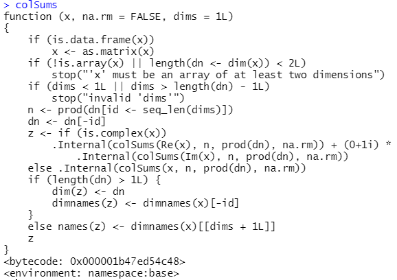
:::

::: {.column width="2%"}
:::

::: {.column width="58%"}
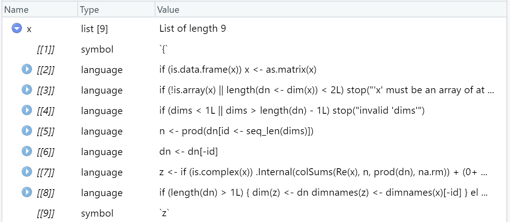
:::
::::::

## identify function step

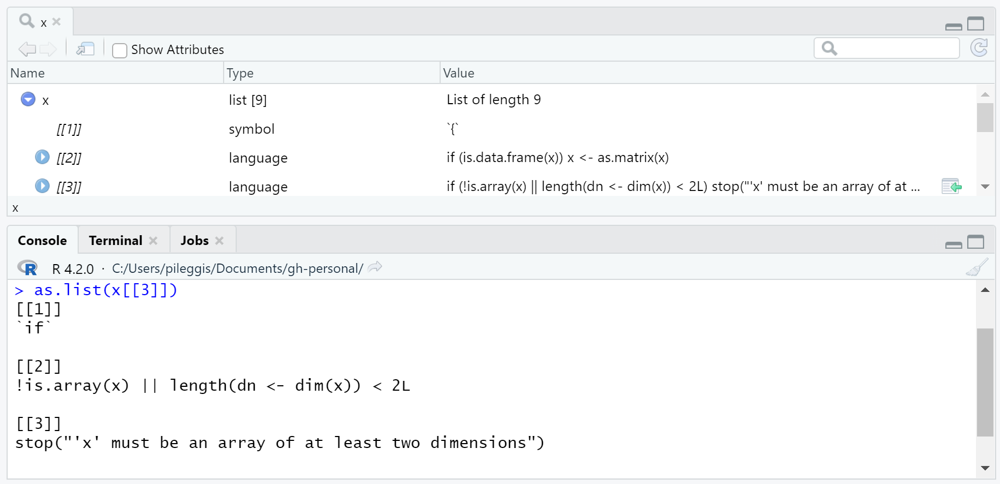

## trace() at specified step

<br>

```{r, eval=FALSE, echo=TRUE,`code-line-numbers`="7,12"}
# identify spot to insert code
as.list(x[[3]][[1]])
# equivalent notation
as.list(x[[c(3, 1)]])

# insert browser at step 3.1
trace(colSums, browser, at = list(c(3, 1)))
# execute function
colSums(1:3)
# ls.str() handy in browser
# cancel tracing
untrace(colSums)
```

## Debugging their code


## Your turn, exercise 03

<br>

```{r, eval=FALSE, echo=TRUE}
# already installed in the Posit Cloud work space
# install.packages("devtools")
# devtools::install_github("rstats-wtf/wtfdbg")
```

<br>

::: question
Complete 03_exercise to practice debugging others' code.
:::

```{r}
countdown(
  minutes = 10
  )
```

::: footer
<https://github.com/rstats-wtf/wtf-debugging>
:::

# Advanced topics {background-color="#FFCD00"}

# Special cases

## Quarto/Rmarkdown {.smaller}

<br>

#### Troubleshooting:

1.  rmarkdown chunk option `error = TRUE` enables knitting with errors

2.  insert `knitr::knit_exit()` and interactively work through .Rmd

::: fragment 
<br>

#### Debugging:

:::

1.  Adv R Ch 22.5.3 RMarkdown <https://adv-r.hadley.nz/debugging.html#rmarkdown>

2.  WTF Ch 11.4 Debugging in Rmarkdown documents <https://rstats.wtf/debugging-r-code.html#debugging-in-r-markdown-documents>

## Piped expressions

<br>

tracebacks can be verbose with pipes

. . .

<br>

```{r, eval=FALSE, echo=TRUE}
options(error = rlang::entrace, rlang_backtrace_on_error = "branch")
```

gives trimmed tracebacks when using pipes

. . .

<br>

- more [contributed answers on RStudio Community](https://community.rstudio.com/t/whats-currently-the-recommended-way-to-debug-pipe-chains/14724/3)

- Matt Dray 2019 blog post [Fix leaky pipes in R](https://www.rostrum.blog/2019/04/07/fix-leaky-pipes/)

## Warnings

<br>

If you want to dig deeper into a warning, you can convert them to errors to initiate debugging tools.

<brshort>

```{r, eval=FALSE, echo=TRUE}
?options
options(warn = 0) # default, stores warnings until top-level function returns
options(warn = 1) # warnings are printed as they occur
options(warn = 2) # upgrades warnings to errors


# initiate recover on warning
options(warn = 2, error = recover)
# restore original settings
options(warn = 0, error = NULL)

```

## Debugging special cases

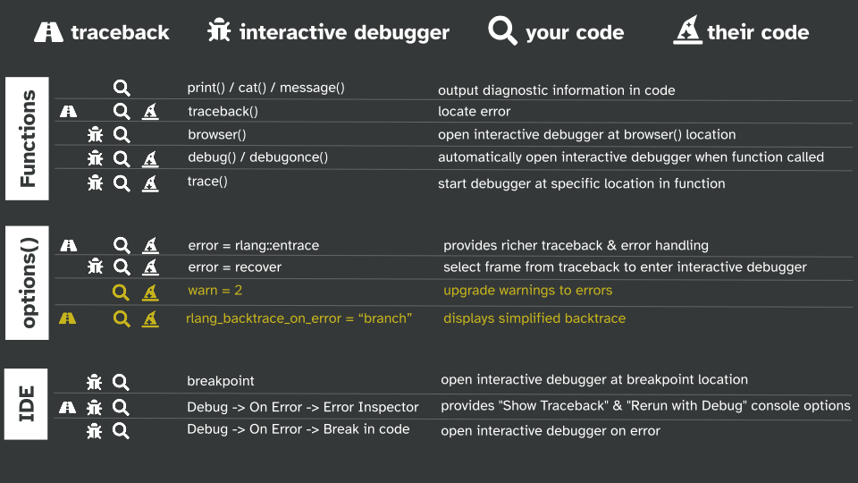

# Advanced: Non-interactive debugging

## Use `callr::r()` or fresh start to look for differences

`callr::r(f, list(1, 2))` calls `f(1, 2)` in a fresh session

- Global env 
- Packages
- Object
- Working directory
- `PATH` environment variable
- `R_LIBS` environment variable

## `dump.frames()` is the equivalent to `recover()` for non-interactive code.

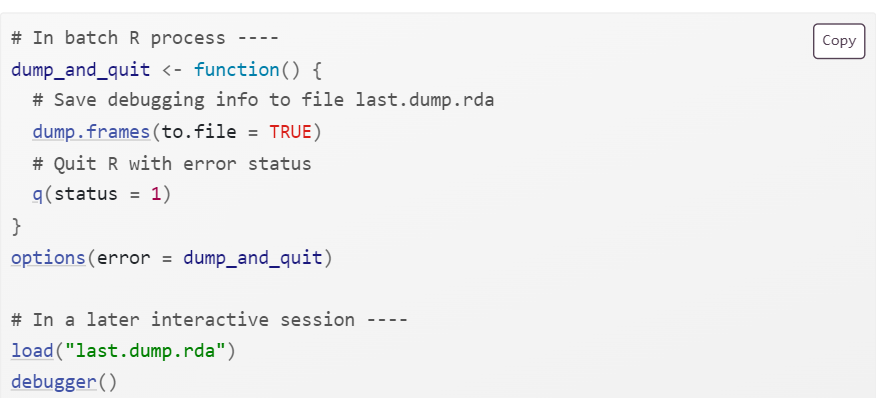


# Wrap up {background-color="#FFCD00"}


## Pick your favorite

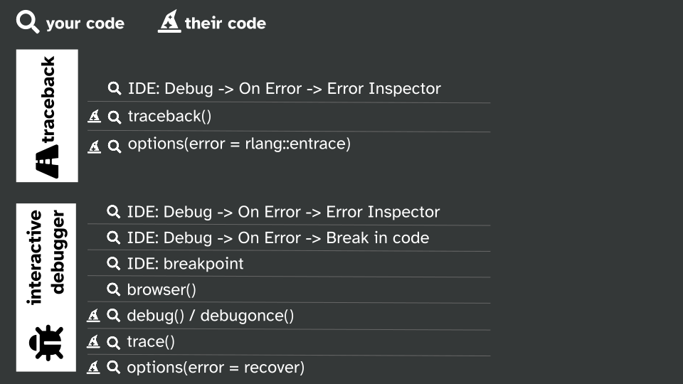

## Watch out!

Functions can fail without errors

- Unexpected warning: `options(warn = 2)` turns warnings into errors.
- Unexpected message: Proposed solution in book no longer available.
- Function might never return. Terminate & `traceback()`.
- Crashed R = bug in compiled (C, C++, etc) code.


## Print debugging can help if nothing else works

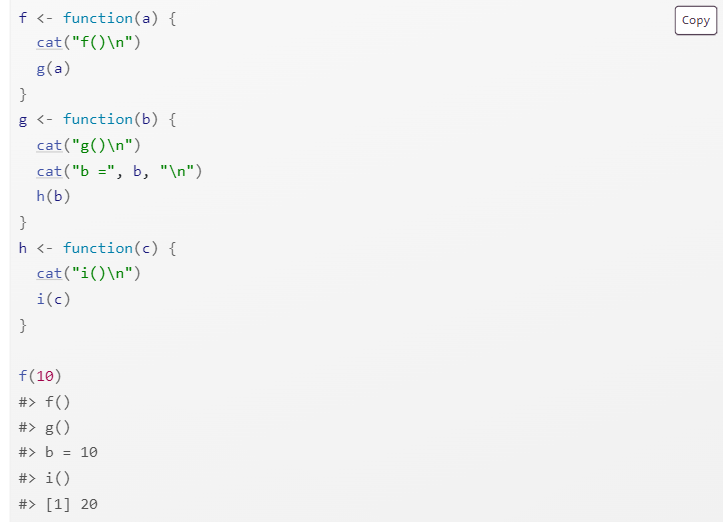

## Go forth, <br> and learn from your bugs!

:::::: columns
::: {.column width="53%"}
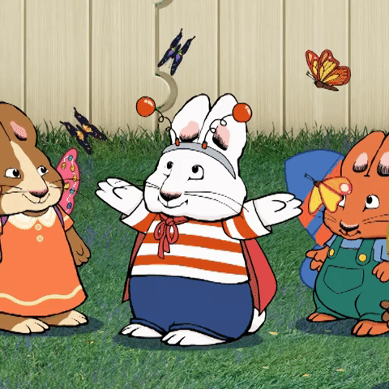{fig-align="center"}
:::

::: {.column width="2%"}
:::

::: {.column width="45%"}
`r fontawesome::fa("road", fill = "black")` traceback

<br>

`r fontawesome::fa("bug", fill = "black")` interactive debugger

<br>

`r fontawesome::fa("magnifying-glass", fill = "black")` your code   vs   <br> `r fontawesome::fa("hat-wizard", fill = "white")` their code
:::
::::::

::: footer
<https://giphy.com/gifs/TreehouseDirect-max-and-ruby-maxandruby-maxruby-S3qtrEqiU5OuwAtg5Z>
:::


## Further reading

Some useful resources on debugging:

- ["Object of type closure is not subsettable"](https://github.com/jennybc/debugging#readme) (Jenny Bryan, `rstudio::conf(2020)`)
- ["What They Forgot to Teach You About R" Chapter 12](https://rstats.wtf/debugging-r) (by Jenny Bryan and Jim Hester)
- [Minimal reprex for a shiny app](https://www.youtube.com/watch?v=9w8ANOAlWy4) (video by Hadley Wickham)
- [Debugging in RStudio, by Posit](https://support.posit.co/hc/en-us/articles/205612627-Debugging-with-the-RStudio-IDE)


- If you have access to "Code Complete", it provides 
  [generic debugging principles](https://www.oreilly.com/library/view/code-complete-2nd/0735619670/ch08.html)
  that are meant to be applicable across programming languages
  
## Additional resources {.smaller}

- WTF Ch 11 *Debugging R code* <br> <https://rstats.wtf/debugging-r-code.html>

- Advanced R Ch 22 *Debugging* <br> <https://adv-r.hadley.nz/debugging.html>

- Jenny Bryan 2020 RStudio Conf Keynote *Object of type closure is not subsettable* <br> <https://github.com/jennybc/debugging#readme>

- Amanda Gadrow 2018 Webinar *Debugging techniques in RStudio* <br> <https://www.rstudio.com/resources/webinars/debugging-techniques-in-rstudio/>

- Jim Hester 2019 *Introduction to debugging in R and RStudio* <br> <https://www.jimhester.com/talk/2019-crug-debugging/>

- Maëlle Salmon 2021 *How to become a better R code detective?* <br> <https://masalmon.eu/2021/07/13/code-detective/>

- Kara Woo 2019 RStudio Conf *Box plots A case study in debugging and perseverance* <https://www.rstudio.com/resources/rstudioconf-2019/box-plots-a-case-study-in-debugging-and-perseverance/>

::: footer
:::

## References


## Advanced: `traceback()` is confusing with lazy evaluation

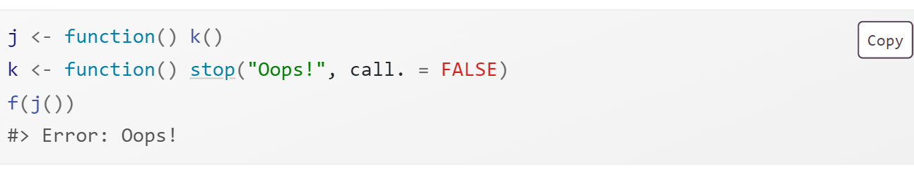

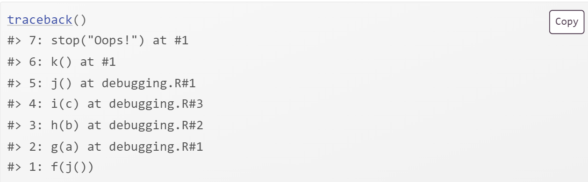

::: notes
- `j()` isn't evaluated until it gets to `i()`.
- I honestly don't find this example all that confusing.
:::

## Advanced: `browser()` can be conditional

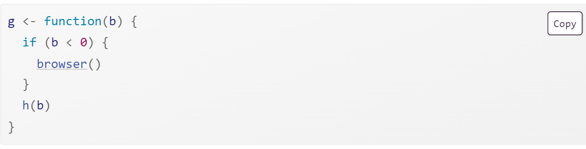

A better practice would be to define your own debugging flags 
that would be turned off or disappear in production code

```
if (exists("my_debugging_flag")) browser()
```

## Advanced: RStudio vs Positron 

Debugging tools in Positron are still under active development. `browser()` and `debugonce()` are supported, but breakpoints aren't.

- [Positron facilitates debugging C++ code](https://youtu.be/8uRcB34Hhsw?si=yzfiNvViVRj8gRXj&t=2827) posit::conf(2024), Davis Vaughn, Aug 2024

- [Positron IDE Debugger for R Demo with Nested Functions (Public Beta)](https://www.youtube.com/watch?v=p_4ZS-nnQ2Q&t=53s) YouTube, James Balamuta, Jun 2024

- [Positron: current joys and pains](https://drmowinckels.io/blog/2025/positron-debugging/), blog post, Athanasia Mowinckel, Apr 2025


## Advanced: Automated tests help

- Add tests for nearby working code to avoid new bugs.
- Add tests for specific broken cases.
- Add tests for hypotheses.

. . . 

Concepts of unit tests are generally associated with R package development,
see [chapters on testing in "Writing R Packages"](https://r-pkgs.org/testing-basics.html).

::: {style="font-size: 75%;"}
Automated testing sometimes brings a dilemma: you add something to a working function, 
and the stuff that you added does work according to the new tests, but an old test gets broken. 
This is may not be an error per se, but it shows a gap in your knowledge of 
and assumptions about the code (see Norm Matloff's quote above) 
and you have to deal with that one way or another.
:::

## Advanced: Debugging withing packages

See _Advanced R_ book (chapter 8) on classed conditions:

- you can create richer structured objects with 

```
rlang::abort(
  message = "cli-formatted-message",
  class   = "your-special-class-to-distinguish-from-other-errors",
  ...
)
```

- you can pass your situation report in `...` so that error handlers
  and/or reporters can more effectively peek into your environment that errored
- you can capture the class with `testthat::expect_s3_class()`

## Advanced: Automate code style checking

`{lintr}` can automate checks to warn you if you leave `browser()` statements in your code.

<br>

<https://lintr.r-lib.org/reference/default_undesirable_functions.html>

<br>

`usethis::use_github_action("lint")`

Live example in `{devtools}` <https://github.com/r-lib/devtools/actions/workflows/lint.yaml>

## Advanced: Debugging Rmarkdown/Quarto has challenges

- Call `rmarkdown::render("path/to/file.Rmd")` instead of IDE knitting.
    * downside: the content of your current environment propagates into the markdown code
- Use `sink()` for tricksy error handling 

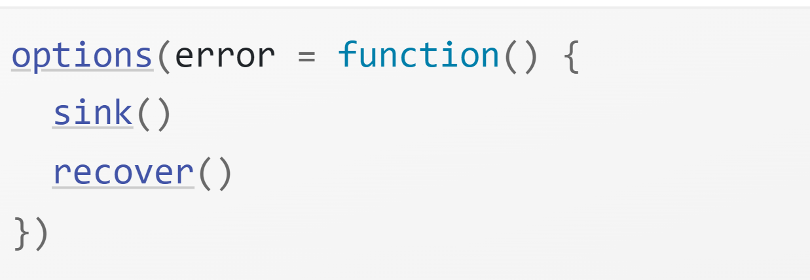{height="110"}

See also ["Markdown test drive"](https://happygitwithr.com/rmd-test-drive.html?q=knit_exit#rmd-troubleshooting)
in Jenny Bryan's _Happy Git With R_ book.


